# 🚀 Building a FastAPI CRUD + ML‑Ready API: A Complete Theoretical and Practical Guide

FastAPI has become the go‑to framework for Machine Learning deployment and modern backend development. This article is a complete lab-style walkthrough that teaches you FastAPI from theoretical foundations to production deployment.

---

## 🔥 Why FastAPI? The Theoretical Foundation

FastAPI isn't just another Python web framework—it's built on solid theoretical principles that make it exceptionally powerful:

### 1. **Type System Integration**
FastAPI leverages Python's type hints (PEP 484) to provide automatic validation. This isn't just syntactic sugar—it's a compile-time and runtime validation system that catches errors before they reach your business logic.

### 2. **ASGI Architecture**
Built on **ASGI (Asynchronous Server Gateway Interface)**, FastAPI inherits the power of async/await patterns. Unlike WSGI (which handles one request at a time), ASGI can handle:
- Multiple concurrent requests
- WebSocket connections
- Long-polling
- Server-sent events

### 3. **Pydantic Models**
Pydantic uses Python's data classes and type hints to provide:
- **Automatic data validation** (type checking, constraint validation)
- **Serialization/deserialization** (JSON ↔ Python objects)
- **Schema generation** (OpenAPI/Swagger documentation)

### 4. **OpenAPI Standard**
FastAPI automatically generates OpenAPI 3.0 schemas, which means:
- Interactive API documentation (Swagger UI)
- Client code generation
- API contract validation
- Integration with API gateways

### Key Advantages:
- ⚡ **Performance**: Comparable to Node.js and Go (thanks to Starlette)
- 🔒 **Type Safety**: Catch errors at development time
- 📚 **Auto Documentation**: Never write API docs manually again
- 🚀 **Async Support**: Handle thousands of concurrent requests
- 🤖 **ML-Ready**: Perfect for deploying ML models as APIs

---

## 🏗️ System Architecture: From Theory to Practice

### High-Level Architecture

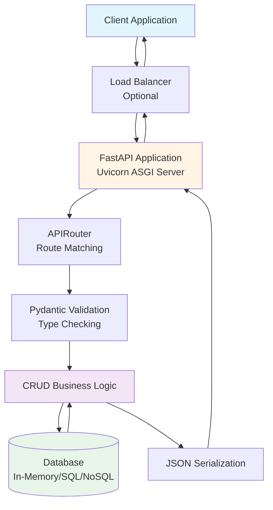

### Network Architecture Diagram

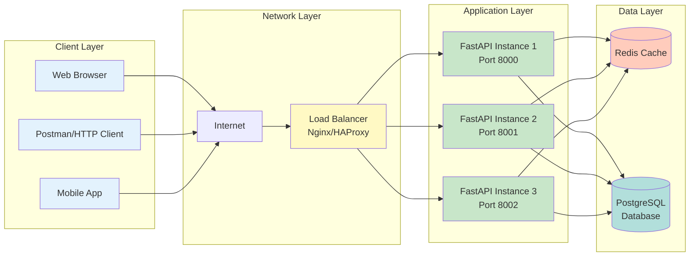

### Request Flow Sequence Diagram

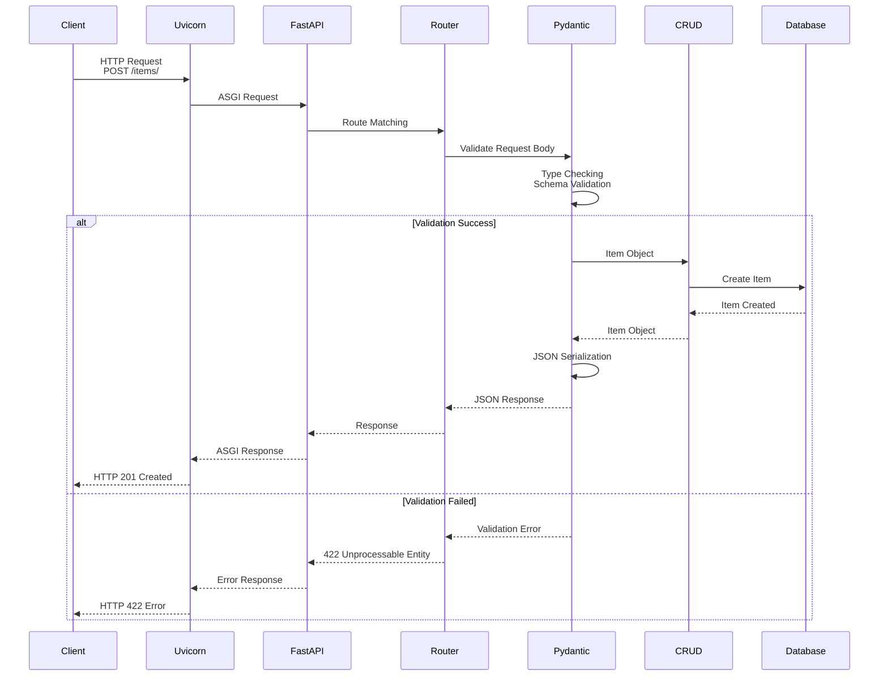

---

## 📁 Project Structure: ML-Ready Architecture

```
fastapi-fundamentals-lab/
├── app/
│   ├── __init__.py          # Package initialization
│   ├── main.py              # FastAPI app instance & configuration
│   ├── routes.py            # API endpoint definitions
│   ├── models.py            # Pydantic models (schemas)
│   ├── crud.py              # Business logic layer
│   └── database.py          # Data access layer
├── requirements.txt         # Python dependencies
├── docker-compose.yml      # Multi-container orchestration
├── Dockerfile              # Container image definition
├── README.md               # Project documentation
└── medium.md               # This article
```

### Architecture Pattern: Layered Architecture

This structure follows the **Layered Architecture Pattern**, which provides:

1. **Separation of Concerns**: Each layer has a single responsibility
2. **Testability**: Each layer can be tested independently
3. **Maintainability**: Changes in one layer don't affect others
4. **Scalability**: Easy to replace layers (e.g., swap in-memory DB with PostgreSQL)

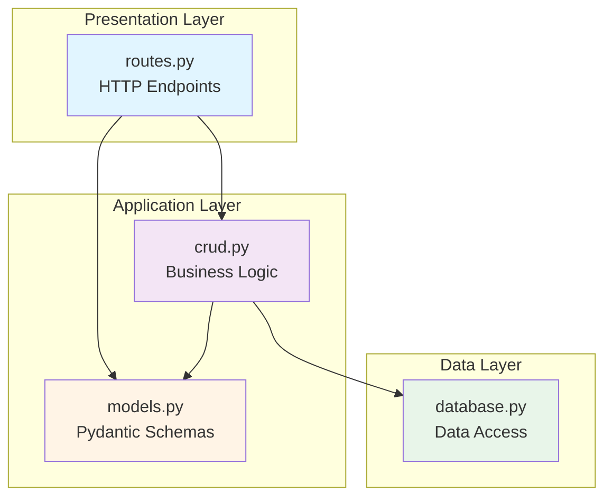

---

## 🧠 Deep Theoretical Breakdown

### 1. FastAPI Application (main.py)

**Theoretical Concept**: FastAPI uses the **Application Factory Pattern** and **Dependency Injection**.

```python
from fastapi import FastAPI
from .routes import router as api_router

app = FastAPI(
    title="FastAPI Fundamentals Lab",
    description="Lab project to learn FastAPI basics, CRUD, and API design.",
    version="0.1.0",
)

@app.get("/")
async def root():
    return {"message": "Welcome to the FastAPI Fundamentals Lab API"}

app.include_router(api_router)
```

**Key Concepts**:
- **FastAPI Instance**: Creates an ASGI application
- **Router Inclusion**: Modularizes endpoints using `APIRouter`
- **Async Functions**: Enables non-blocking I/O operations
- **Automatic JSON**: FastAPI serializes Python dicts to JSON automatically

**Flow**:
1. `FastAPI()` creates an ASGI application
2. Decorators (`@app.get`) register routes
3. `include_router()` adds modular route groups
4. Uvicorn serves the ASGI app

### 2. Pydantic Models (models.py)

**Theoretical Concept**: **Schema Validation** and **Data Transformation** using Python's type system.

```python
from pydantic import BaseModel
from typing import Optional

class Item(BaseModel):
    """
    Pydantic model representing an item in our API.
    
    Fields:
    - id: unique integer identifier
    - name: short name of the item
    - description: optional text describing the item
    """
    id: int
    name: str
    description: Optional[str] = None

    class Config:
        orm_mode = True
```

**How Pydantic Works**:


**Validation Process**:
1. **Type Checking**: Ensures `id` is int, `name` is str
2. **Constraint Validation**: Can add validators (e.g., `id > 0`)
3. **Default Values**: `description` defaults to `None` if not provided
4. **Serialization**: Converts Python objects back to JSON

### 3. CRUD Operations (crud.py)

**Theoretical Concept**: **Repository Pattern** - abstracts data access logic.

```python
from typing import List, Optional
from .models import Item
from .database import items_db

def get_items() -> List[Item]:
    return items_db

def get_item(item_id: int) -> Optional[Item]:
    for item in items_db:
        if item.id == item_id:
            return item
    return None

def create_item(item: Item) -> Item:
    items_db.append(item)
    return item

def update_item(item_id: int, updated_item: Item) -> Optional[Item]:
    for index, item in enumerate(items_db):
        if item.id == item_id:
            items_db[index] = updated_item
            return updated_item
    return None

def delete_item(item_id: int) -> bool:
    for index, item in enumerate(items_db):
        if item.id == item_id:
            del items_db[index]
            return True
    return False
```

**CRUD Flow Diagram**:

```mermaid
graph TD
    Request[HTTP Request] --> Route{Route Type}
    
    Route -->|GET /items/| ReadAll[get_items<br/>Returns all items]
    Route -->|GET /items/{id}| ReadOne[get_item<br/>Returns single item]
    Route -->|POST /items/| Create[create_item<br/>Adds new item]
    Route -->|PUT /items/{id}| Update[update_item<br/>Modifies item]
    Route -->|DELETE /items/{id}| Delete[delete_item<br/>Removes item]
    
    ReadAll --> DB[(Database)]
    ReadOne --> DB
    Create --> DB
    Update --> DB
    Delete --> DB
    
    DB --> Response[HTTP Response]
    
    style Request fill:#e3f2fd
    style Route fill:#fff9c4
    style DB fill:#c8e6c9
    style Response fill:#e3f2fd
```

### 4. API Routes (routes.py)

**Theoretical Concept**: **RESTful API Design** and **HTTP Method Semantics**.

```python
from fastapi import APIRouter, HTTPException
from typing import List, Optional
from .models import Item
from . import crud

router = APIRouter()

@router.get("/items/", response_model=List[Item])
async def read_items():
    return crud.get_items()

@router.get("/items/{item_id}", response_model=Item)
async def read_item(item_id: int):
    item = crud.get_item(item_id)
    if not item:
        raise HTTPException(status_code=404, detail="Item not found")
    return item

@router.post("/items/", response_model=Item, status_code=201)
async def create_item(item: Item):
    return crud.create_item(item)

@router.put("/items/{item_id}", response_model=Item)
async def update_item(item_id: int, updated_item: Item):
    item = crud.update_item(item_id, updated_item)
    if not item:
        raise HTTPException(status_code=404, detail="Item not found")
    return item

@router.delete("/items/{item_id}")
async def delete_item(item_id: int):
    success = crud.delete_item(item_id)
    if not success:
        raise HTTPException(status_code=404, detail="Item not found")
    return {"detail": "Item deleted"}
```

**RESTful Principles**:

| HTTP Method | Endpoint | Action | Status Code |
|------------|----------|--------|-------------|
| GET | `/items/` | List all items | 200 |
| GET | `/items/{id}` | Get single item | 200 or 404 |
| POST | `/items/` | Create new item | 201 |
| PUT | `/items/{id}` | Update item | 200 or 404 |
| DELETE | `/items/{id}` | Delete item | 200 or 404 |

**Route Matching Flow**:

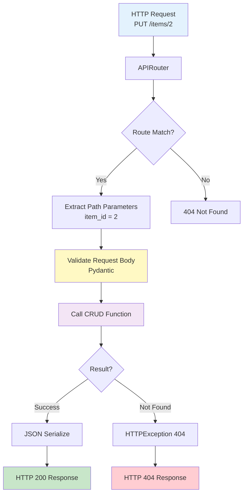

---

## 🌐 End-to-End Request Flow: Complete Theoretical Journey

### Example: Creating an Item (POST /items/)

Let's trace a complete request from client to response:

#### Step 1: Client Sends Request

```http
POST /items/ HTTP/1.1
Host: localhost:8000
Content-Type: application/json

{
  "id": 4,
  "name": "Item Four",
  "description": "Great item"
}
```

#### Step 2: Network Layer Processing

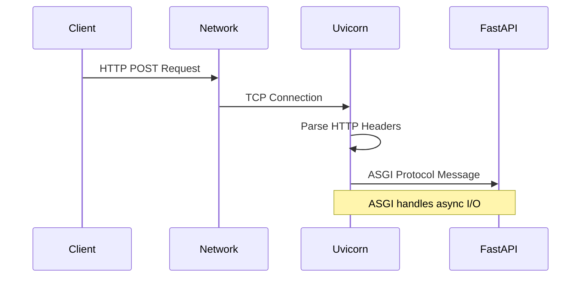

#### Step 3: FastAPI Processing

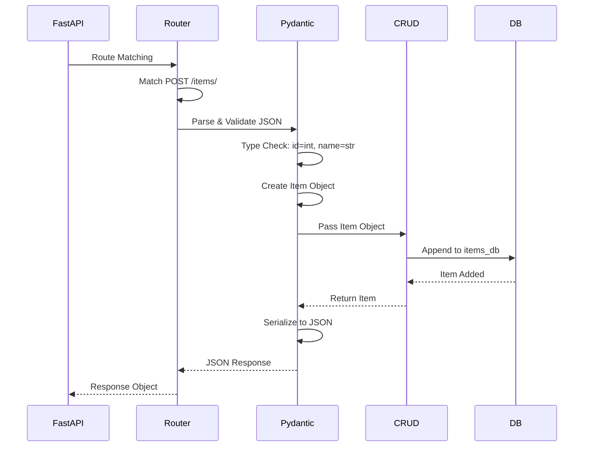

#### Step 4: Response Generation

```http
HTTP/1.1 201 Created
Content-Type: application/json

{
  "id": 4,
  "name": "Item Four",
  "description": "Great item"
}
```

### Complete Flow Diagram

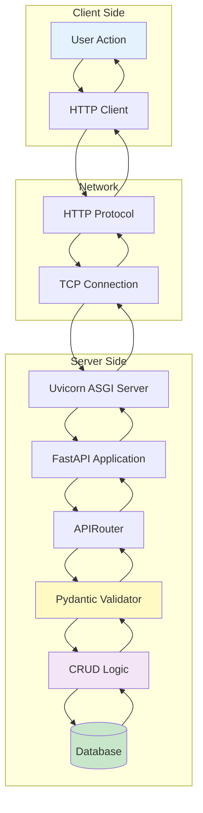

---

## 🧪 Testing: Theory and Practice

### Swagger UI: Interactive API Documentation

FastAPI automatically generates OpenAPI 3.0 schema, which Swagger UI renders as interactive documentation.

**Theoretical Foundation**:
- **OpenAPI Specification**: Industry-standard API description format
- **Schema Generation**: FastAPI introspects your code to generate schemas
- **Interactive Testing**: Swagger UI provides a built-in API client

**Access**: `http://localhost:8000/docs`

### Postman: Advanced API Testing

Postman allows you to:
- Create test suites
- Automate API testing
- Mock APIs
- Generate client code

**Best Practices**:
1. Use environment variables for base URLs
2. Create collections for organized testing
3. Add test scripts for automated validation
4. Export collections for team sharing

---

## 🐳 Docker Deployment: Containerization Theory

### Why Docker?

**Containerization Benefits**:
- **Isolation**: Each container runs in its own environment
- **Portability**: "Works on my machine" → "Works everywhere"
- **Scalability**: Easy to spin up multiple instances
- **Consistency**: Same environment in dev, staging, production

### Docker Architecture

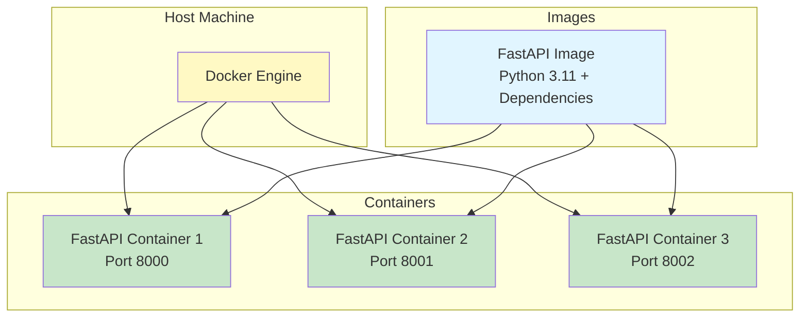

### Docker Compose: Multi-Container Orchestration

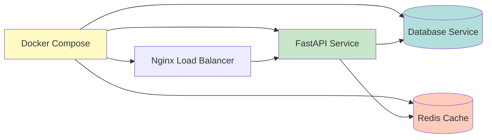

**Deployment Command**:
```bash
docker compose up --build
```

---

## 🤖 ML-Ready API Pattern: Extending for Machine Learning

### Architecture for ML Deployment

```mermaid
graph TB
    Client[Client Request] --> API[FastAPI API]
    API --> Router[Router]
    Router --> PredictRoute[/predict Endpoint]
    PredictRoute --> Validator[Pydantic Validator<br/>Feature Schema]
    Validator --> MLModel[ML Model<br/>TensorFlow/PyTorch]
    MLModel --> PostProcess[Post-Processing]
    PostProcess --> Response[JSON Response]
    
    subgraph "Model Management"
        ModelLoader[Model Loader]
        ModelCache[Model Cache]
    end
    
    MLModel --> ModelLoader
    ModelLoader --> ModelCache
    
    style Client fill:#e3f2fd
    style MLModel fill:#f3e5f5
    style Response fill:#c8e6c9
```

### Example ML Endpoint

```python
from fastapi import APIRouter
from pydantic import BaseModel
import joblib

router = APIRouter()

class Features(BaseModel):
    feature1: float
    feature2: float
    feature3: float

# Load model at startup
model = joblib.load("model.pkl")

@router.post("/predict/")
async def predict(features: Features):
    prediction = model.predict([[features.feature1, 
                                 features.feature2, 
                                 features.feature3]])
    return {"prediction": float(prediction[0])}
```

**Key Concepts**:
- **Model Loading**: Load models at application startup
- **Feature Validation**: Use Pydantic to validate input features
- **Async Processing**: Handle prediction requests asynchronously
- **Response Format**: Return predictions as JSON

---

## 📊 Performance Considerations

### Async vs Sync: When to Use What

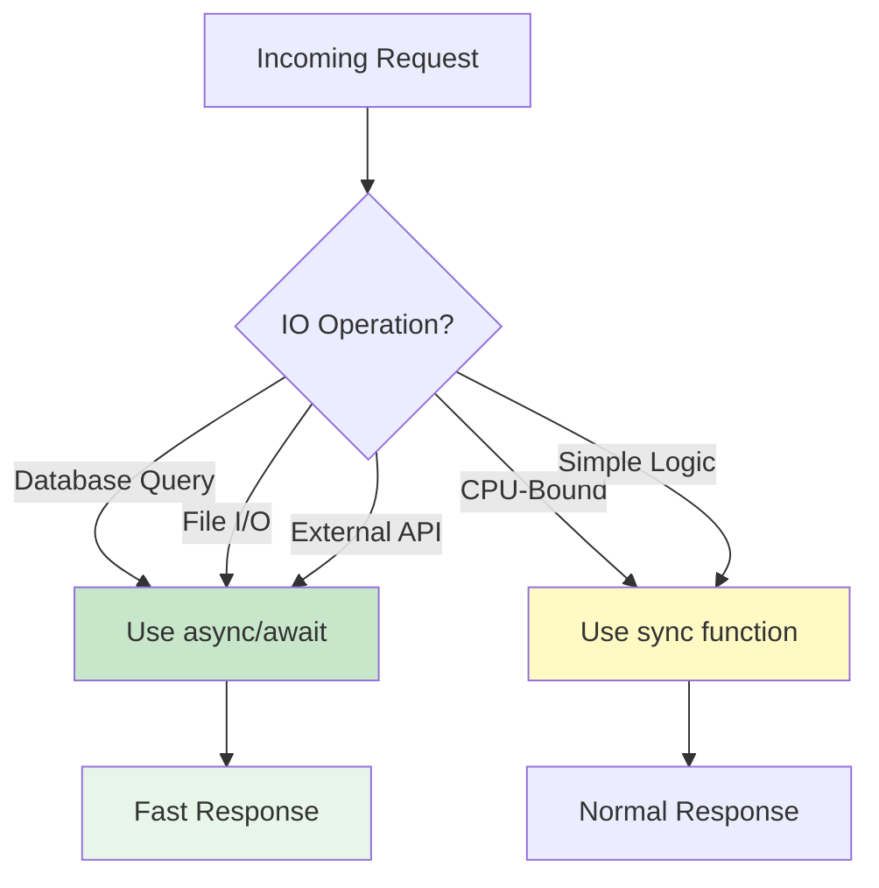

### Scalability Architecture

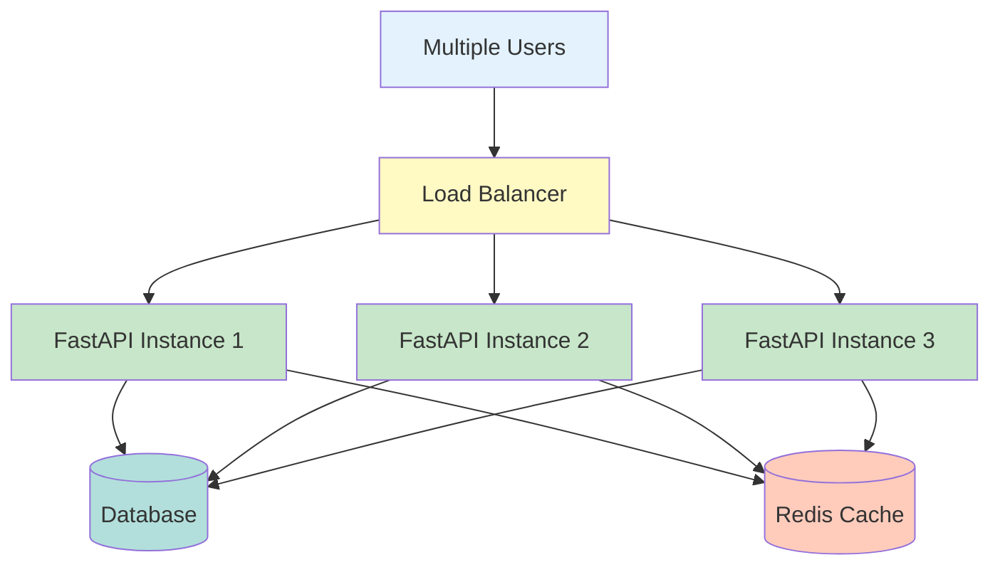

---

## 🏁 Final Thoughts: From Theory to Production

FastAPI represents a perfect blend of:
- **Theoretical Soundness**: Built on proven standards (ASGI, OpenAPI, Pydantic)
- **Practical Simplicity**: Easy to learn, powerful to use
- **Production Readiness**: Handles real-world requirements (async, validation, docs)

### Key Takeaways

1. **Type Hints = Automatic Validation**: Leverage Python's type system
2. **ASGI = Performance**: Async I/O for high concurrency
3. **Pydantic = Data Integrity**: Automatic validation and serialization
4. **OpenAPI = Documentation**: Never write API docs manually
5. **Modular Architecture = Maintainability**: Separate concerns for scalability

### Next Steps

- Replace in-memory database with PostgreSQL/SQLite
- Add authentication (JWT tokens)
- Implement rate limiting
- Add logging and monitoring
- Deploy to cloud (AWS, GCP, Azure)
- Add ML model endpoints

### Resources

- [FastAPI Official Documentation](https://fastapi.tiangolo.com/)
- [Pydantic Documentation](https://docs.pydantic.dev/)
- [Uvicorn Documentation](https://www.uvicorn.org/)
- [OpenAPI Specification](https://swagger.io/specification/)

---

**Happy building! 🚀**

*This guide provides both theoretical understanding and practical implementation. Use it as a foundation for building production-grade APIs with FastAPI.*
